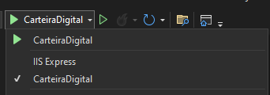

Carteira Digital

Utilizar Visual Code 
->
Abrir um projeto ou uma solução
->
CarteiraDigital.sln

Basta Rodar a Carteira Digital:


(Pode ser preciso instalar IIS Express)

Adicionar Banco de Dados: 
``` 
CREATE DATABASE CarteiraDigital
```

Adicionar Usuário Admin:
```
USE [CarteiraDigital]
GO

INSERT INTO [dbo].[Person]
           ([Id]
           ,[Name]
           ,[Email]
           ,[Salary]
           ,[AccountLimit]
           ,[MinimumValue]
           ,[Balance]
           ,[Username]
           ,[Password])
     VALUES
           (1
           ,'admin'
           ,'admin@example.com'
           ,5000.00
           ,10000.00
           ,100.00
           ,1500.00
           ,'admin'
           ,'123')
GO
```